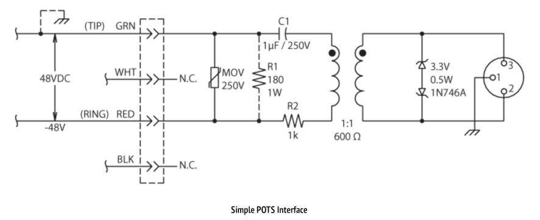
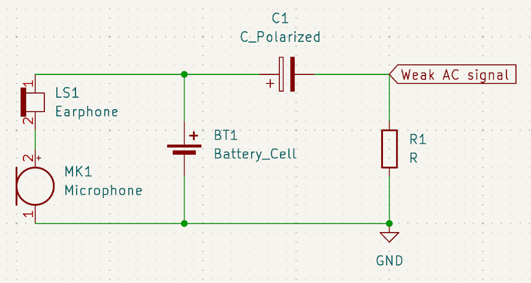
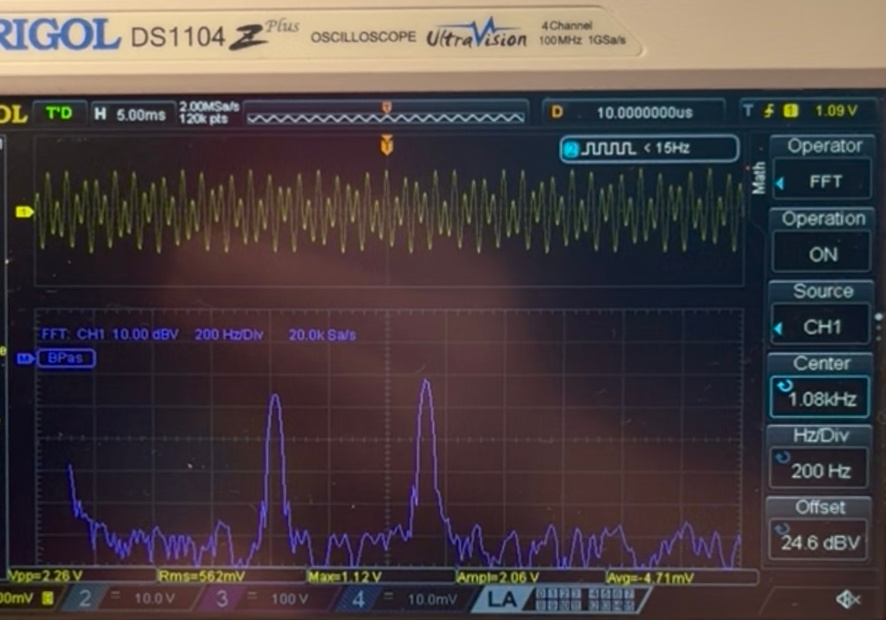
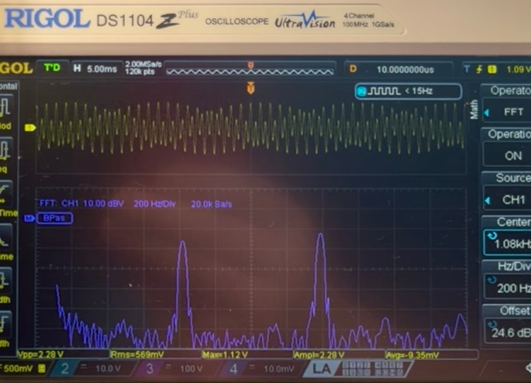
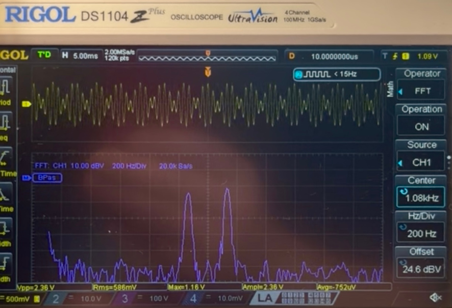
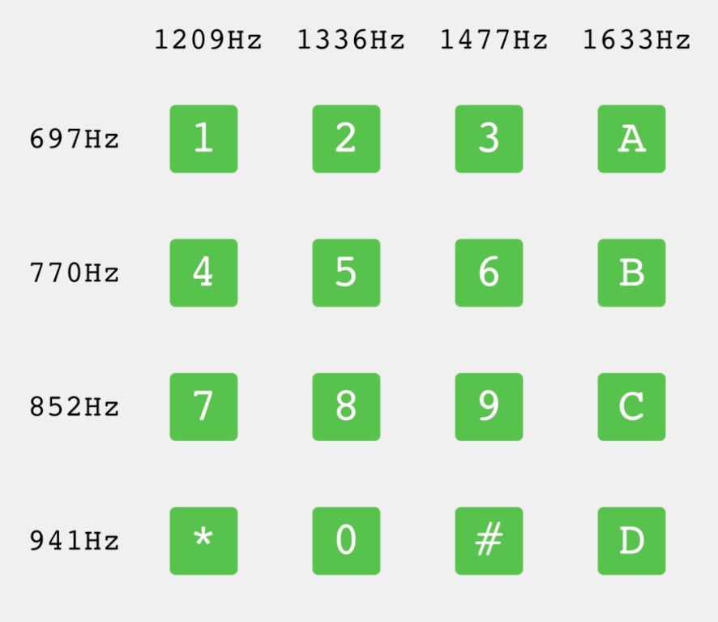
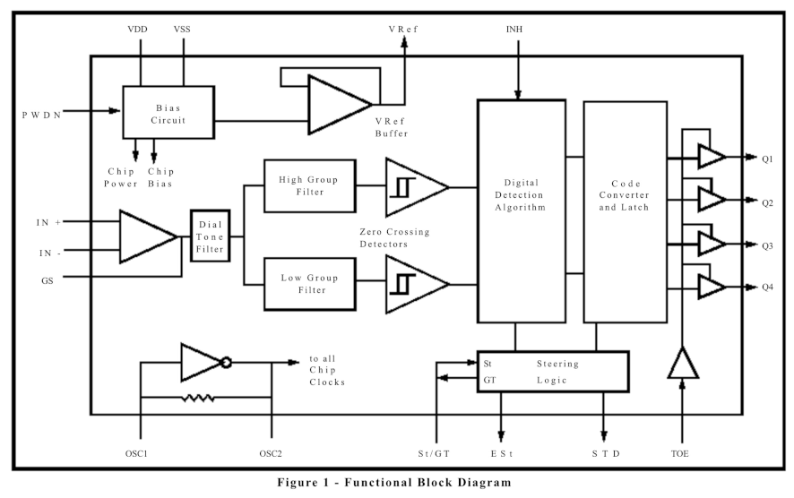
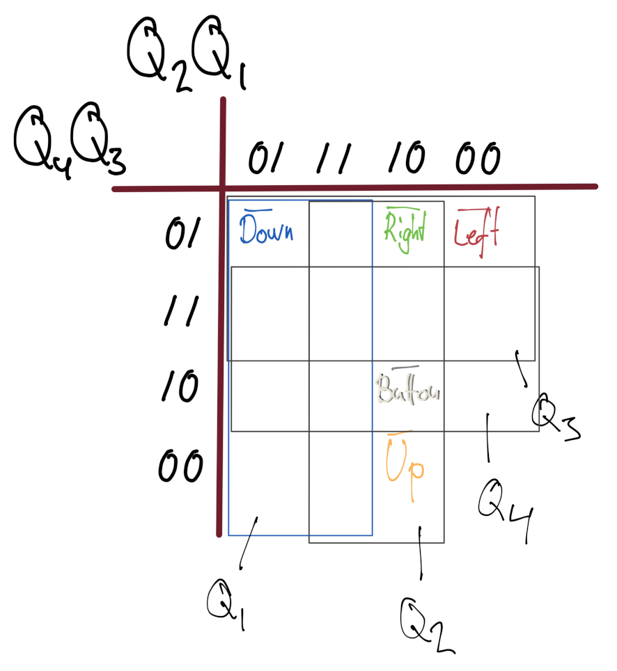
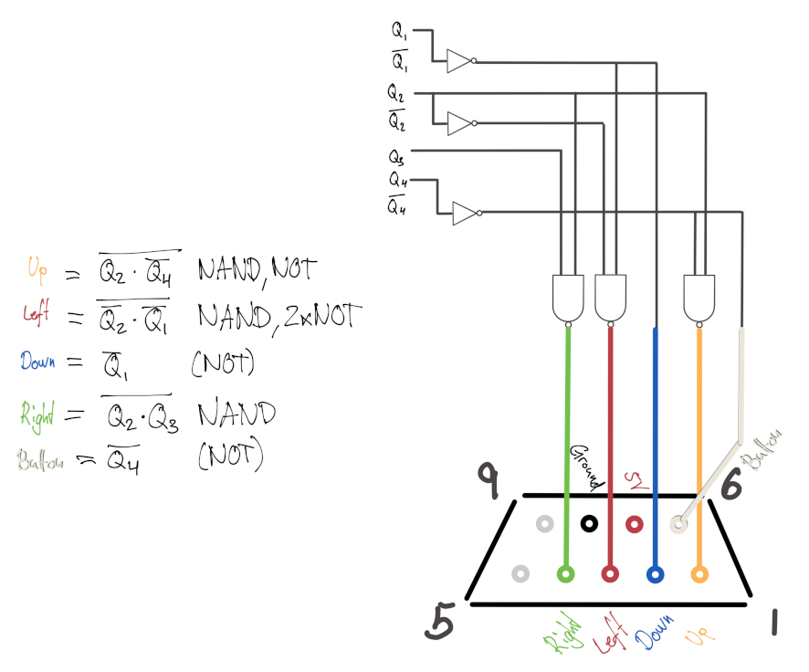

# Arduino Telephone DTMF to Amiga 9-pin joystick adapter for TV classic Hugo game

Note for now: I am very happy and pleased I managed to pull this project off - but _not_ proud of various details in how it is done. Reproduce at your own risk, there is magic smoke ahead...

## Overview

## Plain old telephone service, POTS

An early decision was whether to butcher the telephone, wiring straight onto the keypad, or leaving it intact, actually driving something resembling a telephone circuit and actually decoding the tone (Dual-tone multi-frequency, DTMF) signalling.  
Turns out, the keypad ribbon cable interface looked simple enough, but since the telephone actually decodes its key matrix and encodes DTMF from it (it’s what the keypad is for, after all), I thought it the cleaner path to go, no messing with wiring through the telephone casing.  
There are many ways to revive ([Publicly offered telephone service or Plain old telephone service, POTS](https://en.wikipedia.org/wiki/Plain_old_telephone_service)) telephones and since maintaining some hundred years of backwards compatibility (except for pulse vs DTMF dialling), they’re robust as heck. Realising I didn’t have much telephone equipment available (no jacks or clips and merely a couple meters of torn out wire), it had all been quietly discarded over the years, I also didn’t opt for a full [(IP) telephony system](https://www.amazon.se/dp/B08RB1B1F8), when, turns out you can drive phones by just placing them in series with a 9V battery!  
It was quite the joy to have a (single) live telephone and for instance dialling the phone number of my birth home.  
Here came also the first challenge of how to get a reasonable audio signal out of our telephone circuit (microphone with amplifier creating a ripple around 9V which a speaker can make into sound)? Most projects described online after all use phones to communicate with some kind of phone, or jump straight to DTMF decoding. After reading this excellent article regarding an [audio tap](https://www.ranecommercial.com/legacy/note150.html), and since we didn’t need to act compliant with any proper telephone system, all it took was a crude RC high pass filter, and I could read the millivolts weak audio over the resistor.  

I probably could have used the opportunity to learn how to use [transistors or the opamp chips](https://www.instructables.com/Audio-Amplifier-With-the-LM386) I keep around, but felt like finally trying out the cheapo [LM386 amplifier moduless](https://www.aliexpress.com/item/1005004606022112.html) which also had gathered dust until now. It worked! A clear, manageable signal!  
Se [here](media/DTMF_FFT.mp4) for a clip showing that signal on my oscilloscope. It was yet another achievement to for the first time understand [the oscilloscope settings to show the FFT](https://www.bruksanvisni.ng/rigol/ds1104z-plus/bruksanvisning?p=120) - here centered on 1 kHz with 200 Hz/division, below 5 ms of the 2.4 V AC waveform. Note how "1" appears with the lowest (697 Hz) of the rows group, as well as the lowest (1209 Hz) of the columns group, whereas "3" would be the lowest of the rows and the highest of the three standard columns (1477 Hz). Thus "3" has the peaks widest apart, but "*" has them most narrow (last row, 941 Hz, first column, again 1209 Hz).  

## Dual-tone multi-frequency, DTMF 

So, before telephony went packed switched (IP), signalling (here equivalent to dialling) was done in circuit. Initially as pulse sequences (rotate a spring loaded wheel to create a certain number of pulses) and later as [Dual-tone multi-frequency, DTMF](https://en.wikipedia.org/wiki/DTMF_signaling). Two specific, plain sinusoidal tones as a kind of chord represent the column and row (verify and perhaps swap these around later) of the standardised keypad which has been pressed.  
Generate DTMF tones in your browser [here](https://onlinetonegenerator.com/dtmf.html).

Most projects describe using [a (fairly cheap) decoder module](https://www.aliexpress.com/item/1005006831612752.html) to convert these tones into… digital pins representing the columns and rows. Being really neat and proper, the decoder even [comply with some DTMF standards](https://www.alldatasheet.com/html-pdf/77085/MITEL/MT8870/125/1/MT8870.html) regarding detection timing and output two additional pins signifying when there really, for sure was a keypress detected.  

Not that I required a standards-compliant decoder module, but as an exercise I sketched a circuit of logic gates which might have transcoded the key matrix straight to joystick output.  

 

However, being a masoch… I mean perfectionist, and also since botching my AliExpress shopping cart, hardware decoders wouldn’t arrive on time, so I might as well implement my own in software.   

## DTMF tone detection and the Discrete Fourier Transform

The DTMF decoding module mentioned above, according to its block diagram, filter the rows and columns groups of tones separately and thus can determine frequencies by counting zero-crossings, which doesn't work when tones (and noise) are all mixed together. We will need some kind of discrete Fourier transform, DFT.  
If you have read this far, odds are that you are familiar with the Fast Fourier Transform, FFT. If you're not, let's just say it is a particular way to calculate the full Discrete Fourier Transform, DFT, for some *window* of N samples taken at some *sampling frequency*. Transform is a generic, almost magical mathematical term for changing your data into some different perspective without losing any information, at least within the given criteria. The perspectives applicable to DFT is that given data in the *time domain* you transform it into the *frequency (and phase) domain*, commonly known as a *spectrum* (yes, you probably understood that right, it is comparable to some mix of light, shifting to describing it as which colors/wave lengths/frequencies the light is made up of).

## Goertzel tone detection on arduino

I have a collection of both microcontrollers, single-board computers and various other devices. I considered the Raspberry Pi Pico, or Teensy, good options should I need to perform full FFT. 

Arduino Nano Every / ATMega4809 

https://docs.arduino.cc/hardware/nano-every/
https://content.arduino.cc/assets/Nano-Every_processor-48-pin-Data-Sheet-megaAVR-0-series-DS40002016B.pdf

5kHz sampling

Goertzel

Realtime

https://en.wikipedia.org/wiki/Goertzel_algorithm

https://www.hackster.io/MM_Shoaib/dtmf-decoder-using-only-arduino-872502

https://github.com/AI5GW/Goertzel

https://projecthub.arduino.cc/RoyB/goertzel-algorithm-b39509

## Amiga joystick 

DTMF to joystick

## Circuit

## Todo

* raspberry port, self contained emulator
* Hugo variants
* Cleanup, arduino library, platformio 

## Changelog

* DTMF fft 
* DTMF decoding and 5 pins
* Amiga controller test
* Audio mixing
* Telephone wire
* Cruise! Wiring
* Success!
